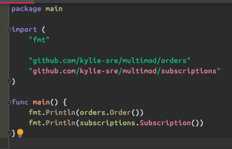

# multimod

example repo demonstrating how to use go modules to enforce isolation between components in a single repo.

---

### Isolation

You can test the isolation by running:

```bash
$ mkdir multimod && cd multimod          
$ go mod init example.com/multimod
$ go get github.com/kylie-sre/multimod/orders
```

To install all the packages use:

```bash
go get -u github.com/kylie-sre/multimod/.../.
```


Only the orders package is available

 
